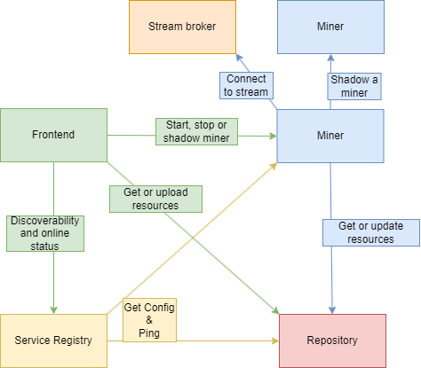
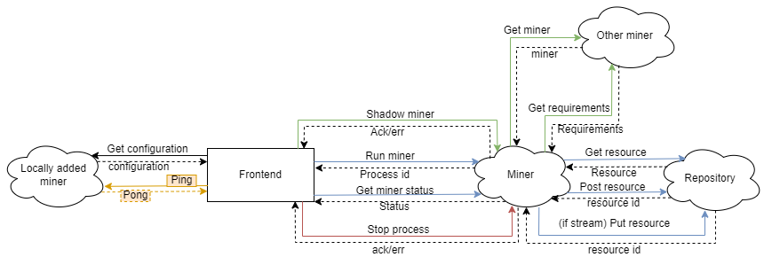
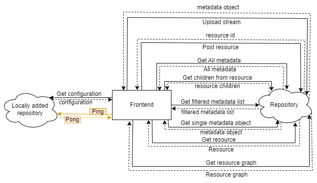
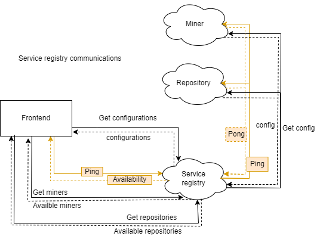

# System
Information on the overall system.

## Project structure

We recommend making a folder structure similar to this.

```
├── <My_parent_folder>
    ├── Miner
    ├── Repository
    └── ServiceRegistry
```

For simplicity, it the projects can be saved the this folders location as follows:

```
├── ProcessDryLab
    ├── Miner
    ├── Repository
    └── ServiceRegistry
```

### Communication

The purpose of this section is to give a brief understanding of the communication that happens and is possible in the system.

The system utilizes a frontend as an entry point for using the system. Any action that is available is implemented in the frontend. It has strong and declarative error handling, therefore it is recommended to use it for interracting with the system. If for some reason this is not desireable, swagger-files can be found in each project or by running the project and navigating to /swagger.

Most services are only responsive, not proactive. This means, that the system won't create processes on it's own. The only exception to this is some cleanup checks in the repository, and ping/configurations for any services added directly to the frontend or in the service registry. 

To increase efficency and load on the system, communication has been centered to the service that will reduce communication the most. By adding services to a service registry, the amount of ping and configurations requests that service receives is reduced. 

All necessary system are provided by downloading all services of PDL. Many external services are not meant for production. We also recommend not using the same stream client when using the stream broker that is described in the miner as this will result in various problems.



#### Miner

The miner is a service that will execute actions when prompted. This can start a sequence of other actions that rely on various services. For a more indepth explanation of the miners communication and internal flows, please read the README in the miner repository.



#### Repository 

The repository is a service that will collect, save, clean and provide resources. It is necessary to have a repository for any action on the system. The default database is built to allow easy access. There is interfaces that allow for easy integration with a standalone database, which is strongly recommended for production environments. 



#### Service registry

The service registry is a service that will allow discoverability of all connected services. This is a tool intended to make groups or organizations, which can add all relevant services, and allow authorized parties to join and inspect the options available. The service registry will reduce the strain of services compared to local connection to the frontend by reducing the amount of ping and configurations requests that is sent to these services.



# Docker compose

If you have the above folder structure, the docker compose file from this project can be moved to <My_parent_folder> to do all the necessary start up steps. Top run the commands, open a terminal and navigate to <My_parent_folder> and run the commands below.

Build all images:
```
docker-compose build
```

Run all projects in seperate containers:
```
docker-compose up
```
This will also create a network and connect all containers to it, enabling communication between the projects. 

Stop all containers:
```
docker-compose down
```

Please be aware, that before you can run this compose file, you need to create and trust a development certificate for service registry. Follow the steps in the serviceRegistry README: https://github.com/ProcessDryLab-master-project/ServiceRegistry

